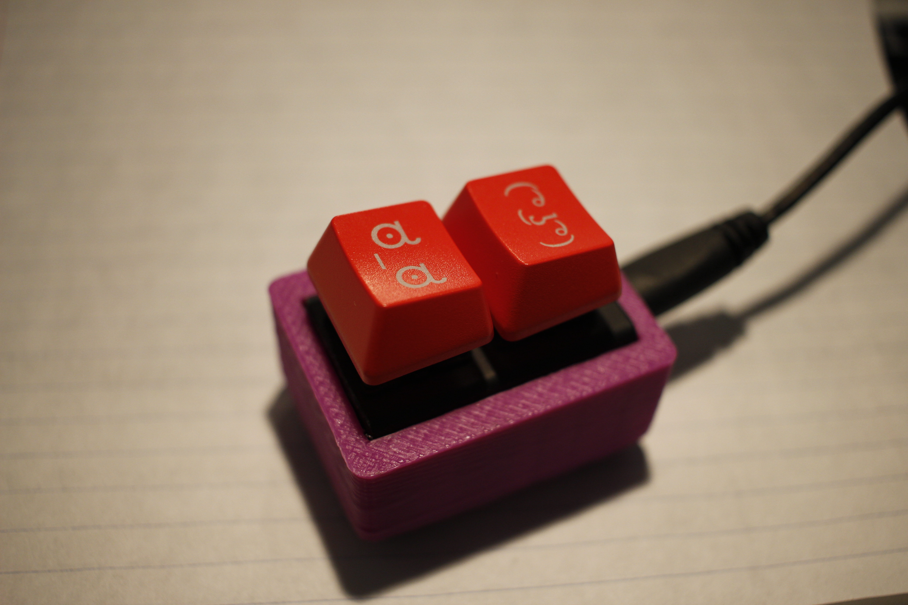

# Mini Emoticon Keyboard
Code for a small trinket based two button keyboard.

## More Information
More information on this project can be found on the instructable for this project, which can be found here: http://www.instructables.com/id/Mini-Emoticon-Keyboard/

You may also want to reference the Adafruit trinket keyboard tutorial, which this code is based off of: https://learn.adafruit.com/trinket-usb-keyboard/

To use this program, you'll need to install the Adafruit TrinketKeyboard library, which can be found here: https://github.com/adafruit/Adafruit-Trinket-USB

### But what does it do?
This code will print a "lenny" face ( ( ͡˚ ͜ʖ ͡˚) ) when a button connected to Pin 0 is pressed and an "are you serious" face ( ಠ_ಠ ) when a button connected to Pin 2 is pressed.

## Programming:
Select Tools->Programmer->USBTinyISP in the Arduino IDE
Press the reset button or unplug/replug the trinket USB cable
Flash the code by pressing Upload within the next 10 seconds (a red LED will be pulsing during this window of time)

Your code should be uploaded!

As it is right now, this will only work correctly when using OSX with 'Unicode Hex Input' enabled in the keyboard settings. Feel free to fork this code to add the correct hex codes for windows! (Or to make it do even more emoticons. The sky is the limit.)